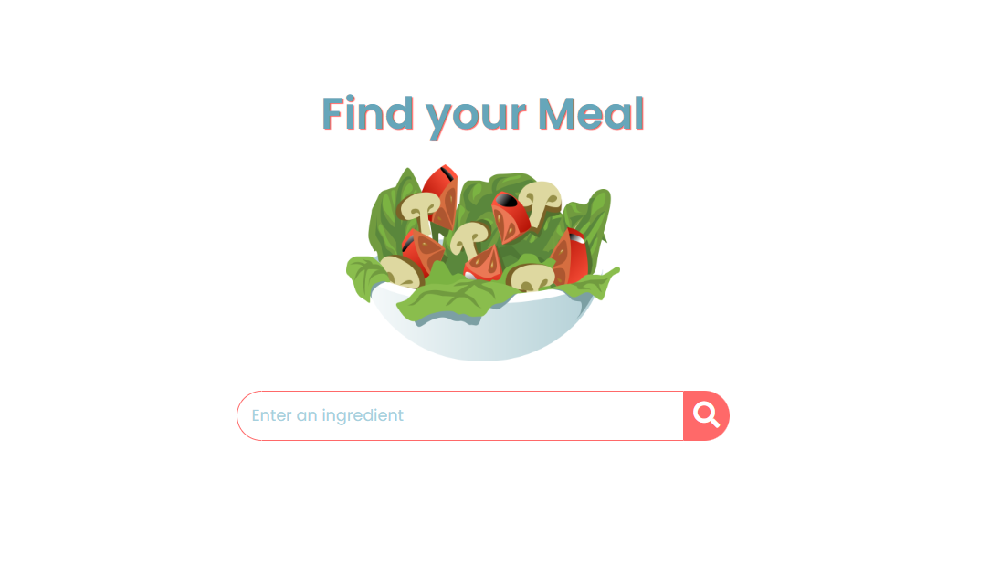
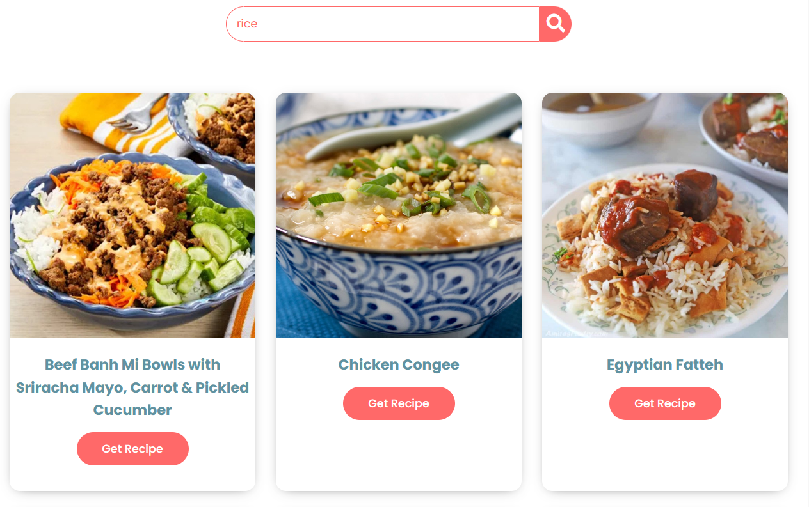
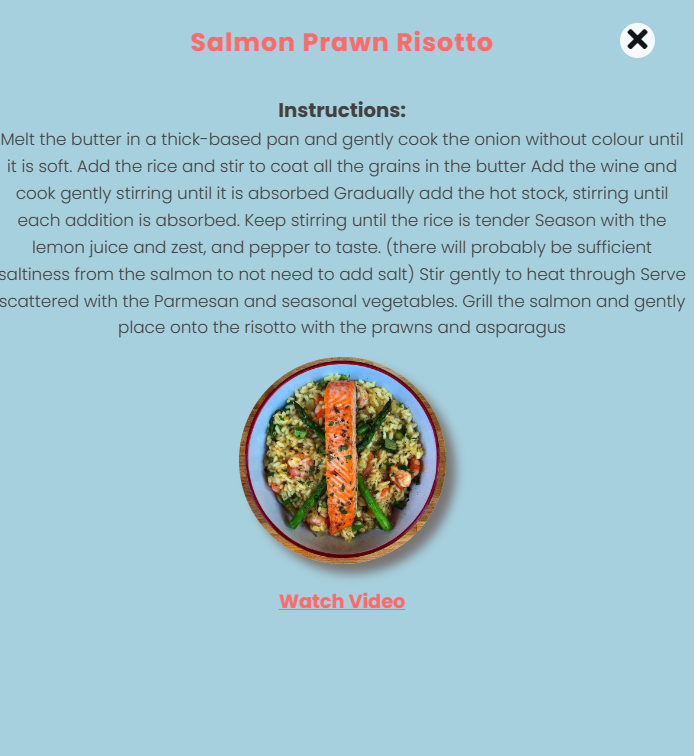

# Recipe-Book

## Description
In this project, we're developing a recipe search application that features a variety of recipes obtained through a free recipe API. 
This is a recipe search application that allows users to search for specific keywords in the available ingredients of each recipe using an advanced search.
The user interface has been designed using HTML5/CSS3 as well as JavaScript. Data are stored locally in JSON format through localStorage API.

##

